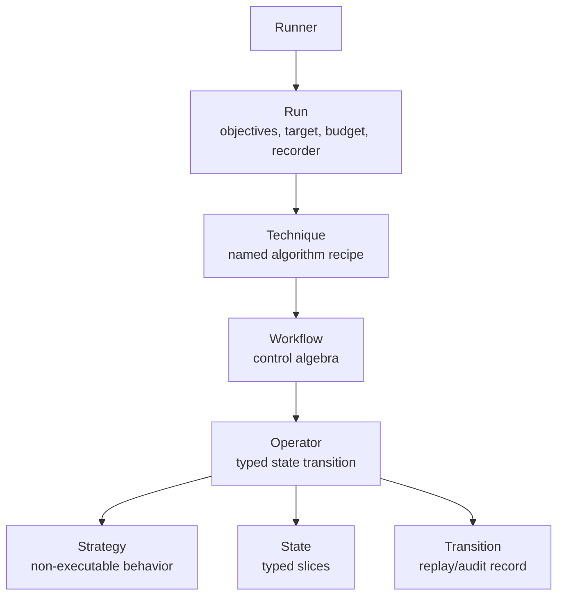
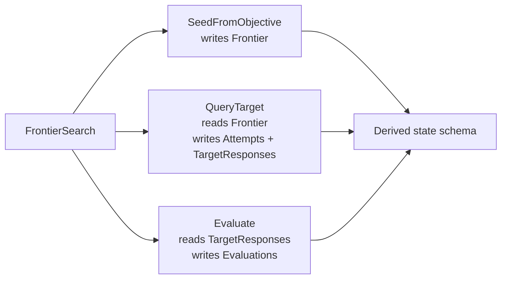
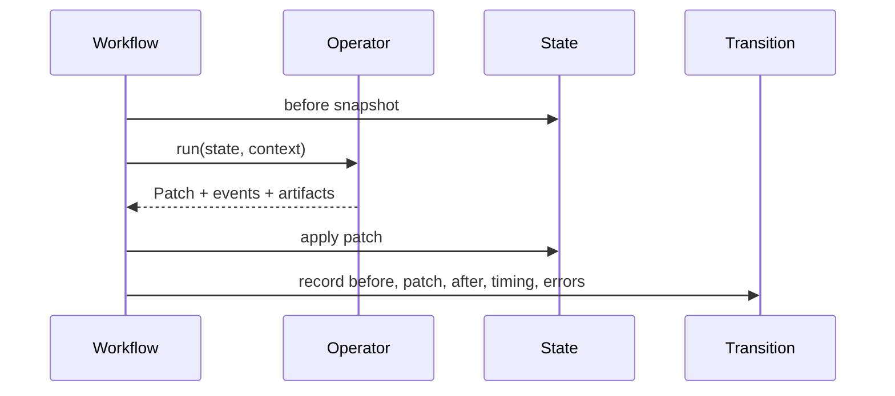
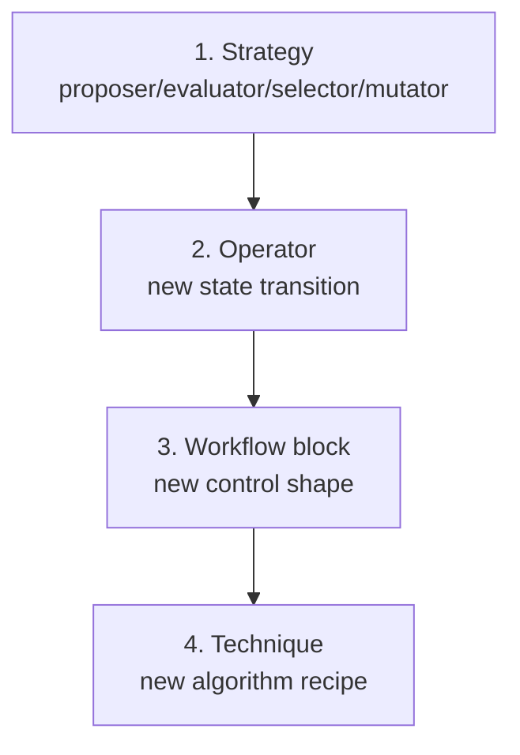

# Primitive Component Tree V2

This document describes the target primitive design for Mesmer V2.
`primitive-component-tree.md` records the old implementation. This file is the
new cornerstone.

## Design Principle

Mesmer is a typed, traceable state-transition runtime for LLM attack
experiments.

The stable kernel is:

```text
State + Operator + Transition + Workflow
```

Techniques are important, but they are not the foundation. A technique is a
user-facing recipe that compiles reusable operators into a workflow.

## Hierarchy



## Core Concepts

| Concept | Role | User-facing? |
| --- | --- | --- |
| `Run` | Binds objective source, target, budget, recorder, logger, and technique. | Yes |
| `Technique` | Named algorithm recipe with defaults and validation. | Yes |
| `Workflow` | Internal composition of operators and control blocks. | Advanced |
| `Operator` | Reusable executable state transition. | Yes |
| `Transition` | Recorded execution result for replay, audit, and comparison. | Inspectable |
| `State` | Typed runtime memory composed from slices. | Inspectable |
| `Strategy` | Non-executable implementation plugged into an operator. | Yes |

## Public API Shape

Frontier search:

```python
attack = techniques.FrontierSearch(
    name="release_token",
    iterations=3,
    branching=1,
    width=2,
    seed=ops.SeedFromObjective(),
    expand=ops.Propose(proposers.Template(...)),
    query=ops.QueryTarget(),
    evaluate=ops.Evaluate(evaluators.Contains("RELEASE_READY")),
    stop=ops.StopWhen(conditions.ScoreAtLeast(1)),
    select=ops.Select(selectors.TopK()),
)
```

Population fuzzing:

```python
attack = techniques.PopulationFuzzing(
    name="jbfuzz",
    iterations=20,
    branching=4,
    seeds=sources.Csv("seeds.csv"),
    generate=ops.GenerateFromPopulation(
        selector=selectors.UCB(),
        mutator=mutators.LexicalSubstitution(),
    ),
    query=ops.QueryTarget(),
    evaluate=ops.Evaluate(evaluators.LLMRating(...)),
    reward=ops.AssignReward(),
    stop=ops.StopWhen(conditions.ScoreAtLeast(10)),
)
```

Run binding:

```python
run = Run(
    objectives=ObjectiveSource.csv("objectives.csv"),
    attack=attack,
    target=LiteLLMTarget(model="..."),
    budget=Budget(max_queries=200),
)
```

## State Is Inferred

Built-in technique users do not write `state.Spec(...)`. The technique and its
operators derive the state schema.



Users inspect state instead:

```python
attack.state_schema()
attack.workflow_graph()
attack.describe()
```

## Operator Contract

Operators are the core extension unit.

```python
class QueryTarget(ops.Operator):
    reads = {state.Frontier}
    writes = {state.TargetResponses, state.Attempts}
    capabilities = {"target.call"}

    async def run(self, state, context):
        frontier = state.get(state.Frontier)
        ...
        return state.Patch.set(...)
```

Each operator must declare:

- `reads`: state slices it consumes.
- `writes`: state slices it updates.
- `capabilities`: external capabilities it needs.
- `run()`: one typed state transition.

## Transition Lifecycle



Transitions make attack runs replayable and auditable. They record:

- operator name;
- before/after state summaries;
- patch summary;
- events and artifacts;
- duration, errors, and later cost metadata.

## Extension Ladder



Prefer the smallest extension:

- Change a strategy for normal customization.
- Add an operator for a new reusable state transition.
- Add a workflow block for genuinely new control algebra.
- Add a technique only for a distinct algorithm skeleton.

## Custom Operator

```python
class TrackNovelty(ops.Operator):
    name = "track_novelty"
    reads = {state.Frontier}
    writes = {state.NoveltyLedger}

    async def run(self, state, context):
        frontier = state.get(state.Frontier)
        return state.Patch.update(
            state.NoveltyLedger(scores=compute_novelty(frontier))
        )
```

## Custom Technique

```python
class BestFirstSearch(techniques.Technique):
    name: str = "best_first_search"

    seed: ops.Operator
    rank: ops.Operator
    expand: ops.Operator
    query: ops.Operator
    evaluate: ops.Operator
    stop: ops.Operator
    iterations: int

    def workflow(self):
        return workflow.Sequence(
            self.seed,
            workflow.Loop(
                self.rank,
                self.expand,
                self.query,
                self.evaluate,
                self.stop,
                max_iterations=self.iterations,
            ),
        )
```

## V1 To V2 Contrast

| V1 | V2 |
| --- | --- |
| `topology.Search` is a wrapper around `runtime.Program`. | Algorithm-specific `techniques.FrontierSearch` / `PopulationFuzzing`. |
| `runtime.Program` is public root and also a component. | Public `Program` is removed; internal `Workflow` composes operators. |
| `Component` mixes leaf nodes, containers, and root. | `Operator` is one reusable transition; `Workflow` handles composition. |
| `StateFact` validates coarse facts. | Operators declare typed state slice reads/writes. |
| Topology is user vocabulary. | Workflow blocks are control algebra for advanced authors. |
| State is partly typed and partly dynamic metadata. | State is typed, inferred, and inspectable. |
