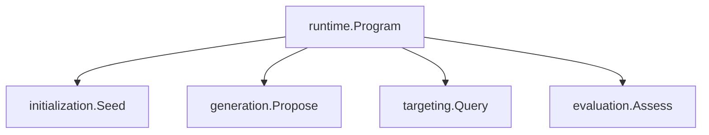
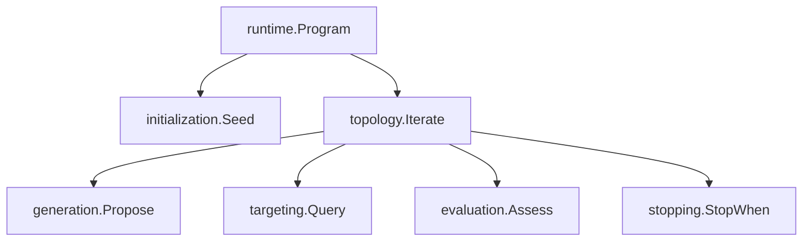
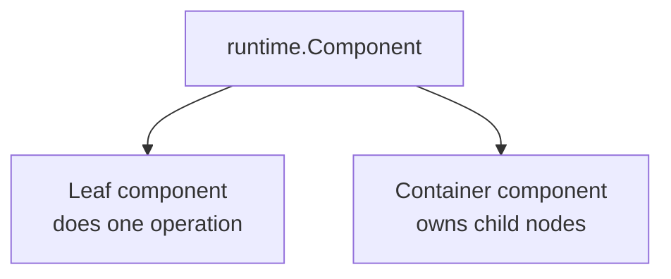
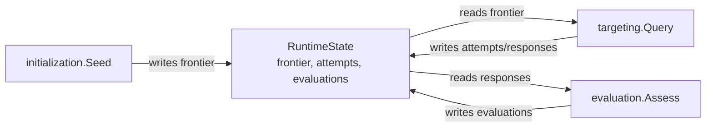
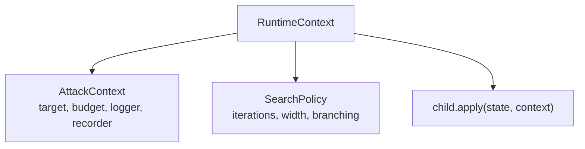
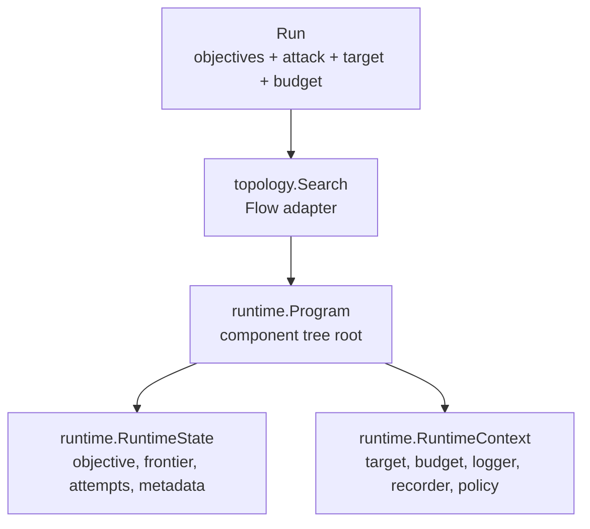
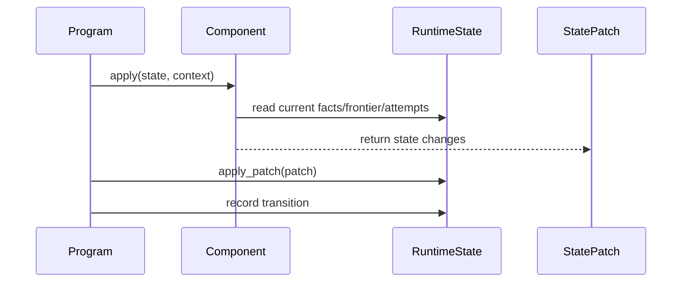
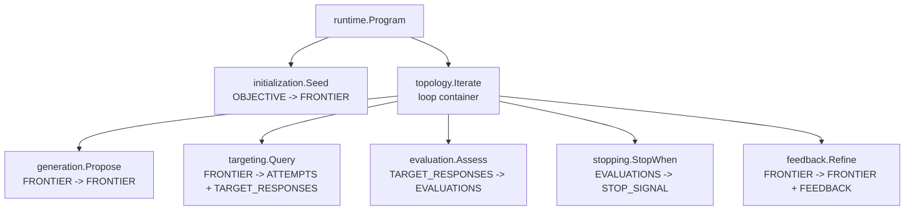
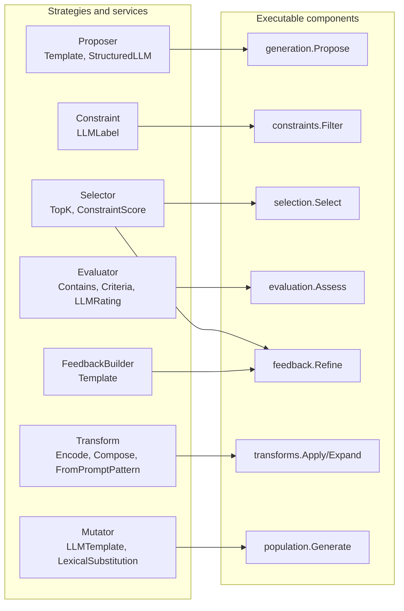
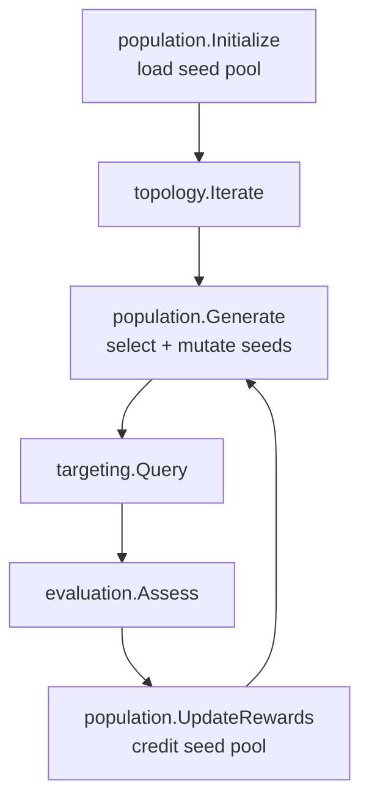

# Primitive Component Tree

This document explains the current Mesmer primitive system from the center
outward. It is descriptive, not a redesign proposal. The point is to make the
framework's pattern visible enough that we can question it clearly.

React is easier to learn because it has a strong center: everything starts from
components, components receive props, components may have state, and context
passes shared values down the tree. Mesmer has a similar shape, but we have not
made it as explicit.

The closest current design principle is:

> A Mesmer attack is an executable component tree that transforms typed runtime
> state through ordered state patches.

Everything else hangs from that.

## Core Mental Model

Mesmer has five core ideas:

| Idea | React analogy | Mesmer object | Meaning |
| --- | --- | --- | --- |
| Tree | Component tree | `runtime.Program` | The ordered attack workflow. |
| Node | Component | `runtime.Component` | A unit of execution that reads state and returns a patch. |
| State | Component/app state | `runtime.RuntimeState` | The mutable attack state: objective, frontier, attempts, evaluations, metadata, history. |
| Update | State setter/reducer output | `runtime.StatePatch` | The explicit state change produced by a component. |
| Context | Context/provider | `runtime.RuntimeContext` | Shared execution context: target, budget, recorder, logger, active policy. |

The same five ideas appear in code like this.

### Tree: `runtime.Program`

`runtime.Program` is the root node of the executable component tree. It is not
the loop. It is not the topology. It is the thing that owns the workflow tree.

At the simplest level, a program can be a flat ordered tree:



```python
program = runtime.Program(
    initialization.Seed(),
    generation.Propose(generation.Template()),
    targeting.Query(),
    evaluation.Assess(evaluation.Contains(text="RELEASE_READY")),
)
```

It becomes a deeper tree when one of its children is a container component:



```python
program = runtime.Program(
    initialization.Seed(),
    topology.Iterate(
        policy=topology.Policy(iterations=3, branching=1, width=1),
        children=[
            generation.Propose(generation.Template()),
            targeting.Query(),
            evaluation.Assess(evaluation.Contains(text="RELEASE_READY")),
            stopping.StopWhen(stopping.ScoreAtLeast(1)),
        ],
    ),
)
```

`topology.Search` is only needed when this program must be passed to `Run` as an
attack flow:

```python
attack = topology.Search(name="release_token_single_turn", program=program)
```

What makes `Program` a tree:

- It is a container component with ordered children.
- A child can be a leaf component, such as `targeting.Query`.
- A child can also be another container component, such as `topology.Iterate`.
- Execution walks the tree in order and records transitions for each child.

What this reveals: the core idea is `Program -> children`. `topology.Search`
obscures that because it wraps the program for the runner. `topology.Iterate`
also obscures it because examples pass its children with `children=[...]`, while
`runtime.Program` commonly takes children positionally.

### Node: `runtime.Component`

A node is one executable item in the tree. There are two shapes:



A leaf component does one operation:

```python
class Query(Component):
    name: str = "query"
    requires: set[StateFact] = Field(default_factory=lambda: {StateFact.FRONTIER})
    provides: set[StateFact] = Field(
        default_factory=lambda: {StateFact.TARGET_RESPONSES, StateFact.ATTEMPTS}
    )

    async def apply(self, state: RuntimeState, context: RuntimeContext) -> StatePatch:
        target = context.attack.target
        attempts = []
        for trajectory in state.frontier:
            response = await target.call(trajectory.candidate.messages, ...)
            attempts.append(Attempt(..., response=response))
        return StatePatch(append_attempts=attempts, provided=self.provides)
```

A container component is also a node, but it owns other nodes:

```python
class Iterate(ContainerComponent):
    name: str = "iterate"
    policy: SearchPolicy = Field(default_factory=SearchPolicy)

    async def apply(self, state: RuntimeState, context: RuntimeContext) -> StatePatch:
        for iteration in range(1, self.policy.iterations + 1):
            for child in self.children:
                patch = await child.apply(state, context.with_policy(self.policy))
                state.apply_patch(patch)
        return StatePatch(provided=self.provides)
```

What this reveals: `runtime.Program` and `topology.Iterate` are both container
nodes. `targeting.Query` and `generation.Propose` are leaf nodes. But public
modules also expose non-nodes such as `generation.Template`, so users must learn
which names can actually appear in the tree.

### State: `runtime.RuntimeState`

State is the shared runtime object that every node reads from and writes to
through patches. The tree does not pass outputs directly from one component to
the next. Components coordinate through `RuntimeState`.



```python
state = runtime.RuntimeState.for_objective(objective)

state.frontier          # active CandidateTrajectory list
state.attack_state      # public AttackState returned to the runner
state.iteration         # loop iteration set by topology.Iterate
state.history           # recorded component transitions
state.metadata          # shared metadata and dynamic extension point
```

Paper examples can add state fields by subclassing:

```python
class JBFuzzState(runtime.RuntimeState):
    seed_pool: population.Pool | None = None

program = runtime.Program(
    population.Initialize(...),
    initialization.Seed(),
    topology.Iterate(...),
    state=JBFuzzState,
)
```

What this reveals: typed state extension exists, but some components also write
dynamic fields or metadata. That makes the framework flexible, but validation
cannot always see the real dependency.

### Update: `runtime.StatePatch`

`StatePatch` is the explicit update object. The component says "here is what
changed"; the container applies it and records the transition.

```python
class ObjectiveSeed(Component):
    requires: set[StateFact] = Field(default_factory=lambda: {StateFact.OBJECTIVE})
    provides: set[StateFact] = Field(default_factory=lambda: {StateFact.FRONTIER})

    async def apply(self, state: RuntimeState, context: RuntimeContext) -> StatePatch:
        seed = CandidateTrajectory(
            candidate=Candidate(messages=[user_message(state.objective.goal)])
        )
        return StatePatch(frontier=[seed], provided=self.provides)
```

A patch can replace frontier, append attempts, set stop reasons, add metadata,
or mark facts as provided:

```python
StatePatch(
    frontier=[trajectory],
    append_attempts=[attempt],
    stop_reason="success",
    metadata={"seed_pool_size": 12},
    provided={StateFact.FRONTIER},
)
```

The container applies and records each child patch:

```python
before = StateSnapshot.from_state(state)
patch = await child.apply(state, context)
state.apply_patch(patch)
after = StateSnapshot.from_state(state)
state.record_transition(child.name, before, patch, after)
```

What this reveals: `StatePatch` is a strong core idea. The weaker part is that
some components mutate objects already inside `state` and return only metadata
or `provided` facts, so not every state change is visible in the patch shape.

### Context: `runtime.RuntimeContext`

Context is the shared execution environment flowing down the tree. State is the
data being transformed. Context is the outside world and shared runtime services
needed to transform it.



```python
context = RuntimeContext(
    attack=AttackContext(
        target=run.target,
        judges=run.judges,
        budget_tracker=budget_tracker,
        recorder=run.recorder,
        logger=logger,
    )
)
```

`topology.Iterate` adds policy to context before calling children:

```python
for child in self.children:
    patch = await child.apply(state, context.with_policy(self.policy))
```

Children then read the active policy indirectly:

```python
policy = _policy(context)
selected = self.selector.select(state.frontier, policy.width)
```

What this reveals: context is the hidden wiring layer. It keeps constructors
small, but it also hides important dependencies such as branching factor, width,
and parallelism from the component's public configuration.

The framework is not "everything is a component" in the React sense. A better
current rule is:

> Everything executable is a component. Everything configurable is usually a
> strategy, source, policy, condition, evaluator, selector, mutator, or model
> used by a component.

That distinction matters. `generation.Propose` is executable and belongs in the
component tree. `generation.Template` is not executable by itself; it is a
proposer strategy used by `generation.Propose`.

## Runtime Layers



There are three layers that often get collapsed in examples:

| Layer | Current primitive | What it does |
| --- | --- | --- |
| Runner-facing attack | `topology.Search` | Adapts a `runtime.Program` to the runner's `Flow` interface. |
| Component tree root | `runtime.Program` | Owns ordered components and the runtime state type. |
| Workflow nodes | `runtime.Component` subclasses | Execute one step and return `StatePatch`. |

This is why `topology.Search` and `topology.Iterate` feel inconsistent today:
they live in the same module, but they are not the same kind of thing.
`Search` receives a complete `Program` because it is a flow adapter. `Iterate`
receives policy and children because it is a container component inside the
program.

## Component Execution

Every executable component follows the same runtime contract:



The validation model is fact-based:

- A component declares facts it `requires`.
- A component declares facts it `provides`.
- `runtime.Program` validates that children are ordered so requirements are met.
- The actual mutable data still lives on `RuntimeState`.

This gives us a core tree shape:



## The Core Primitive Families

These are the concepts an author needs first. They are the framework's center.

### 1. Runtime Substrate

The substrate is the generic execution system.

| Primitive | Role |
| --- | --- |
| `runtime.Component` | Base class for executable nodes. |
| `runtime.ContainerComponent` | Component that owns child components. |
| `runtime.Program` | Root container for a technique's component tree. |
| `runtime.RuntimeState` | Mutable state for one objective execution. |
| `runtime.StatePatch` | Explicit update returned by a component. |
| `runtime.RuntimeContext` | Shared execution context passed to every component. |

Design implication: if something changes attack state, it should probably be a
component. If it only chooses, scores, loads, mutates, or formats something for
a component, it should probably not be a component.

### 2. Topology

Topology describes control flow, not paper-specific attack logic.

| Primitive | Role | Current shape |
| --- | --- | --- |
| `topology.Search` | Runner-facing flow adapter | Receives `program`. |
| `topology.Iterate` | Loop container component | Receives `policy` and children. |
| `topology.Policy` | Loop/search policy | Holds iterations, branching, width, parallelism, stop behavior. |

Current tension: `Search` is named like a topology primitive but behaves like an
adapter. `Iterate` is a real topology component. This is the main conceptual
mismatch in the current public API.

### 3. Frontier

The frontier is the active set of candidate trajectories being searched.

| Primitive | Role |
| --- | --- |
| `CandidateTrajectory` | Candidate plus provenance, response, evaluations, constraints, feedback. |
| `initialization.Seed` | Creates the initial frontier from an objective. |
| `generation.Propose` | Expands frontier items into new trajectories. |
| `selection.Select` | Retains frontier items. |
| `feedback.Refine` | Adds feedback and retains frontier items. |
| `transforms.Apply` / `transforms.Expand` | Rewrites or expands frontier items through transforms. |

Most attack logic is frontier logic. A component either creates the frontier,
expands it, filters it, queries it, evaluates it, or chooses what survives.

### 4. Target Boundary

Target interaction is centralized.

| Primitive | Role |
| --- | --- |
| `targeting.Query` | Calls the target and creates attempts/responses. |
| `targeting.Continue` | Adds target responses back into candidate messages for multi-turn flows. |
| Target adapters | `LiteLLMTarget`, `PythonCallableTarget`, HTTP, SSE, WebSocket targets. |

Design implication: target calls should remain visible in the component tree.
They are the expensive and safety-relevant boundary.

### 5. Evaluation, Stopping, Feedback

These are separate on purpose:

| Family | Component | Strategy/model | Responsibility |
| --- | --- | --- | --- |
| Evaluation | `evaluation.Assess` | `evaluation.Evaluator` | Score or label target responses. |
| Stopping | `stopping.StopWhen` | `stopping.Condition` | Convert evaluation facts into a stop signal. |
| Feedback | `feedback.Refine` | `feedback.Builder`, `selection.Selector` | Convert observations into future search context. |

The distinction is useful: evaluation says what happened, stopping decides
whether to end, feedback decides what information should guide the next step.

## Utility Families Around The Core

Once the core tree is understood, the other primitives are easier to place.
They are mostly strategies and data models plugged into executable components.



### Generation Strategies

| Primitive | Kind | Used by |
| --- | --- | --- |
| `generation.Generator` / `Proposer` | abstract strategy | `generation.Propose` |
| `generation.Template` | proposer | `generation.Propose` |
| `generation.StructuredLLM` | proposer | `generation.Propose` |
| `generation.Actor`, `generation.LiteLLMActor` | actor service | LLM proposers, evaluators, seed sources, mutators |
| `generation.StructuredOutputSpec` | config model | `generation.StructuredLLM` |

### Constraint And Selection Strategies

| Primitive | Kind | Used by |
| --- | --- | --- |
| `constraints.Constraint` | abstract strategy | `constraints.Filter` |
| `constraints.LLMLabel` | constraint | `constraints.Filter` |
| `selection.Selector` | abstract strategy | `selection.Select`, `feedback.Refine` |
| `selection.TopK` | selector | `selection.Select`, `feedback.Refine` |
| `selection.ConstraintScore` | selector | `selection.Select`, `feedback.Refine` |
| `selection.KeywordOverlap` | selector | `selection.Select`, `feedback.Refine` |

### Evaluation And Stopping Strategies

| Primitive | Kind | Used by |
| --- | --- | --- |
| `evaluation.Evaluator` | abstract strategy | `evaluation.Assess` |
| `evaluation.Contains` | evaluator | `evaluation.Assess` |
| `evaluation.Criteria` | evaluator | `evaluation.Assess` |
| `evaluation.LLMRating` | evaluator | `evaluation.Assess` |
| `evaluation.SequenceClassification` | evaluator | `evaluation.Assess` |
| `evaluation.EmbeddingSequenceClassifier` | classifier adapter | `evaluation.SequenceClassification` |
| `stopping.Condition` | abstract strategy | `stopping.StopWhen` |
| `stopping.ScoreAtLeast` | condition | `stopping.StopWhen` |

### Prompt Pattern Utilities

Prompt patterns are data and selection context. They are not target calls,
evaluators, or transforms by themselves.

| Primitive | Kind | Used by |
| --- | --- | --- |
| `prompts.PromptPattern` | data model | prompt sources, selectors, transforms |
| `prompts.PromptLibrary` | data model | prompt selectors |
| `prompts.ListSource`, `JsonSource`, `BuiltinSource` | sources | `prompts.Select`, `prompts.TemplateSeedSource` |
| `prompts.All`, `Tag`, `Id`, `Random`, `WithoutReplacement`, `RoundRobin` | selectors | `prompts.Select`, `prompts.TemplateSeedSource` |
| `prompts.Select` | component | attaches selected pattern context to trajectories |
| `prompts.MarkUsed` | component | updates pattern usage ledger |
| `prompts.TemplateSeedSource` | seed source | `population.Initialize` |

### Transform And Variation Utilities

Transforms operate on candidate trajectories. Variation mutators operate on
seed text for population search.

| Primitive | Kind | Used by |
| --- | --- | --- |
| `transforms.Transform` | abstract strategy | `transforms.Apply`, `transforms.Expand` |
| `transforms.Encode` | transform | `Apply`/`Expand` |
| `transforms.TemplateWrap` | transform | `Apply`/`Expand`, prompt patterns |
| `transforms.PayloadSplit` | transform | `Apply`/`Expand` |
| `transforms.CharacterRewrite` | transform | `Apply`/`Expand` |
| `transforms.Compose` | transform | `Apply`/`Expand`, prompt patterns |
| `transforms.FromPromptPattern` | transform | `Apply`/`Expand` |
| `variation.Mutator` | abstract strategy | `population.Generate` |
| `variation.LLMTemplate` | mutator | `population.Generate` |
| `variation.LexicalSubstitution` | mutator | `population.Generate` |
| `variation.WordNetSynonyms` | synonym provider | `variation.LexicalSubstitution` |

### Population Search Utilities

Population search adds a second evolving state object: a seed pool. The current
implementation is useful, but it is less integrated with `StateFact`
validation because pool fields are stored dynamically.



| Primitive | Kind | Used by |
| --- | --- | --- |
| `population.Pool` | state model | population components |
| `population.Record` | state model | population pool |
| `population.Source` | abstract source | `population.Initialize` |
| `population.ListSource`, `CsvSource`, `StructuredLLMSource` | sources | `population.Initialize` |
| `population.Initialize` | component | loads seed pool into runtime state |
| `population.Generate` | component | creates frontier from selected and mutated seeds |
| `population.UpdateRewards` | component | updates seed rewards and weights |
| `population.Random`, `RoundRobin`, `WeightedRandom`, `UCB`, `EXP3` | seed selectors | `population.Generate` |

## Current Fault Lines

These are the places where the current pattern is hard to see.

| Area | Current shape | Why it is confusing |
| --- | --- | --- |
| `topology.Search` vs `topology.Iterate` | Same namespace, different abstraction layers | `Search` is a flow adapter; `Iterate` is a component. |
| Program children vs loop children | `Program(a, b)` and `Iterate(children=[...])` both appear | The same tree uses two authoring idioms. |
| Components vs strategies | Modules mix executable nodes and helper objects | Users must infer which objects go in the tree. |
| Singular/plural constructors | Some wrappers accept `evaluator=`, some accept lists, containers accept children | Ownership of one-vs-many is inconsistent. |
| Frontier selection | `selection.Select` and `feedback.Refine` both retain frontier items | The boundary between selecting and refining needs clearer language. |
| Transform naming | `Apply` and `Expand` currently share behavior | Names imply different behavior that is not implemented yet. |
| Dynamic state | Population and prompt usage write dynamic fields/metadata | Validation cannot see all runtime dependencies. |
| Hidden policy dependency | Branching/width/parallelism flow through `RuntimeContext.policy` | Components that depend on policy do not show it in their constructor. |

## A Clearer Vocabulary For Discussion

Before redesigning, we should use these terms consistently:

| Term | Meaning today |
| --- | --- |
| Flow adapter | Runner-executable wrapper, currently `topology.Search`. |
| Program | Root executable tree, currently `runtime.Program`. |
| Container component | Component with children, currently `runtime.ContainerComponent` and `topology.Iterate`. |
| Leaf component | Executable tree node that returns `StatePatch`, such as `targeting.Query`. |
| Strategy | Non-executable object called by a component, such as `selection.TopK`. |
| Source | Non-executable object that loads data for a component. |
| Policy | Shared execution configuration, currently `topology.Policy`. |
| State model | Typed runtime data, such as `CandidateTrajectory`, `EvaluationResult`, or `population.Pool`. |

That vocabulary gives us the simplest current explanation:

> `Search` adapts a program to a run. `Program` owns the tree. Components mutate
> runtime state through patches. Strategies configure components. `Iterate` is
> just one component: a loop container with a policy.

If we want the framework to feel more intuitive, the future API should make
that sentence obvious from the public names and constructor shapes.
