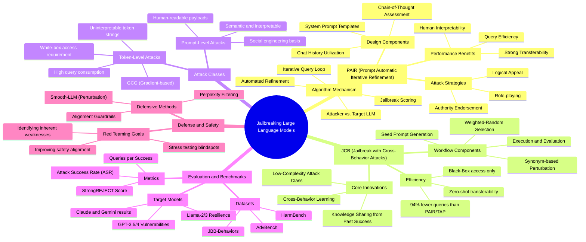

A few notes on what I did:

- Wrapped any node text containing parentheses in `["..."]` shape syntax — Mermaid otherwise tries to parse `(...)` as a shape modifier and chokes.
- Gave the branch nodes short ID prefixes (`AM`, `DC`, `JCB`, etc.) so I could attach the bracketed labels cleanly. Pure-text nodes (the leaves) don't need IDs.
- Indentation is 2 spaces per level — Mermaid's mindmap parser is whitespace-sensitive, so don't reformat with tabs.

If you'd rather have it as a `flowchart TD` (more layout control, less of the radial mindmap look), let me know and I'll re-do it.