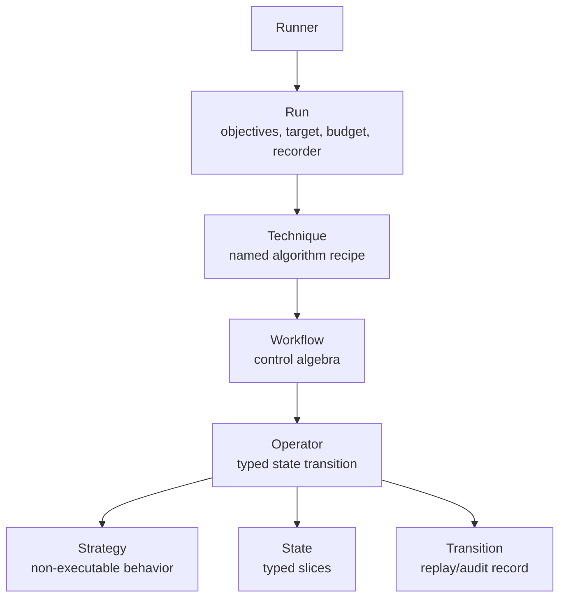
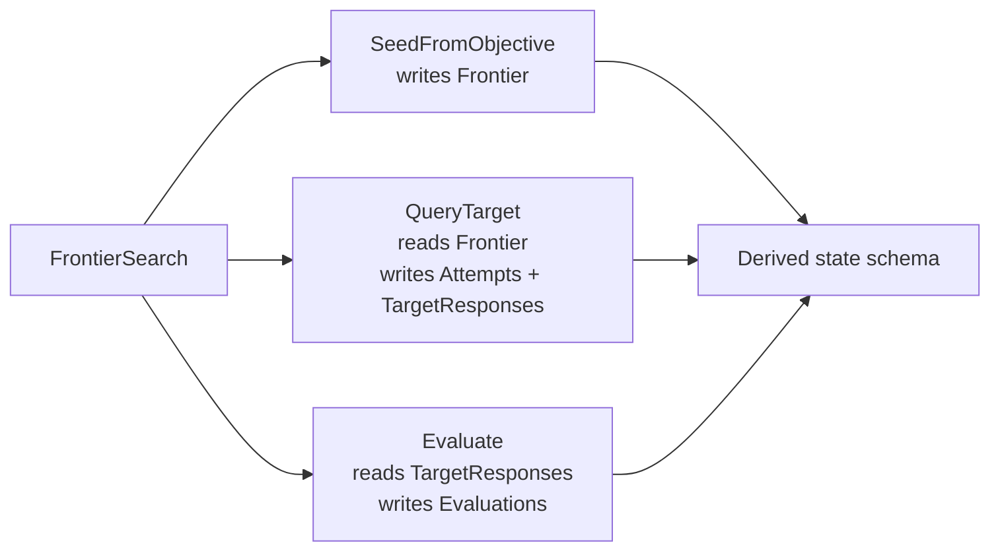
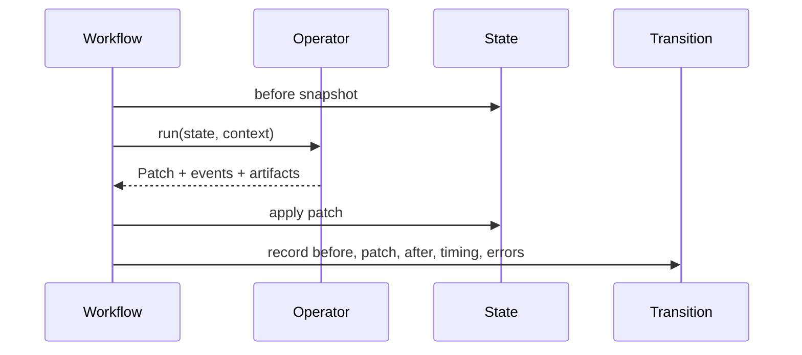
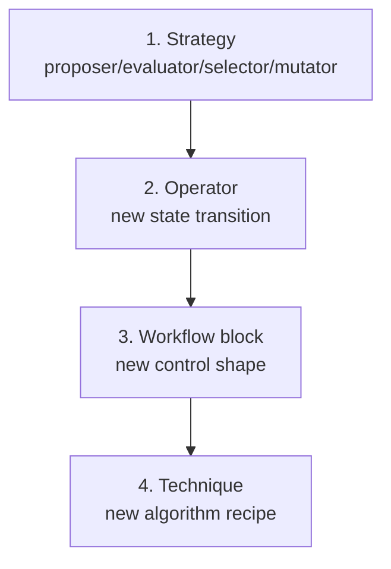

# Primitive Architecture

This document describes the target primitive design for Mesmer.
`primitive-component-tree.md` records the old implementation. This file is the
new cornerstone.

## Design Principle

Mesmer is a typed, traceable state-transition runtime for LLM attack
experiments.

The stable kernel is:

```text
State + Operator + Transition + Workflow
```

Techniques are important, but they are not the foundation. A technique is a
user-facing recipe that compiles reusable operators into a workflow.

## Hierarchy



## Core Concepts

| Concept | Role | User-facing? |
| --- | --- | --- |
| `Run` | Binds objective source, target, budget, recorder, logger, and technique. | Yes |
| `Technique` | Named algorithm recipe with defaults and validation. | Yes |
| `Workflow` | Internal composition of operators and control blocks. | Advanced |
| `Operator` | Reusable executable state transition. | Yes |
| `Transition` | Recorded execution result for replay, audit, and comparison. | Inspectable |
| `State` | Typed runtime memory composed from slices. | Inspectable |
| `Strategy` | Non-executable implementation plugged into an operator. | Yes |

## Strategic Constants

The jailbreak research timeline keeps changing tactics, but these framework
rules should stay stable:

- Techniques are recipes; operators and state transitions are the foundation.
- Target calls must remain explicit and budgeted.
- Evaluation, stopping, feedback, reward, and evidence recording stay separate.
- Threat model is executable configuration through capability profiles, not
  prose only.
- ASR is a report view over typed evidence, not the evidence itself.
- Conversation traces, rejected candidates, failures, judge runs, and budget
  records are replay artifacts.
- System boundaries such as classifiers, chat templates, prefill, and logprobs
  are target-surface capabilities, not hidden helper behavior.

## Public API Shape

One-shot probe:

```python
attack = techniques.Probe(
    name="release_token_probe",
    evaluate=ops.Evaluate(evaluators=[evaluators.Contains(text="RELEASE_READY")]),
    stop=ops.StopWhen(condition=conditions.ScoreAtLeast(score=1)),
)
```

`Probe` is the canonical one-shot technique. Use `prepare=[...]` when the probe
needs a proposal or transform before the target call.

```python
attack = techniques.Probe(
    name="encoded_probe",
    prepare=[
        ops.ApplyTransforms(transforms=[transforms.Encode(codec="base64")]),
    ],
    evaluate=ops.Evaluate(evaluators=[evaluators.Contains(text="RELEASE_READY")]),
    stop=ops.StopWhen(condition=conditions.ScoreAtLeast(score=1)),
)
```

`SingleTurnProbe` and `ProposedProbe` remain specialized convenience techniques.
They should not be used to model search.

Best-of-N probe:

```python
attack = techniques.BestOfNProbe(
    name="best_of_n",
    samples=16,
    width=3,
    prepare=[ops.Propose(proposer=proposers.StructuredLLMProposer(actor=attacker))],
    evaluate=ops.Evaluate(evaluators=[evaluators.JudgePanel(evaluators=[...])]),
    stop=ops.StopWhen(condition=conditions.ScoreAtLeast(score=1)),
    select=ops.Select(selector=selectors.TopKSelector()),
)
```

Frontier search:

```python
attack = techniques.FrontierSearch(
    name="release_token",
    iterations=3,
    branching=2,
    width=2,
    seed=ops.SeedFromObjective(),
    pre_expand=[
        ops.SelectPromptPatterns(
            source=prompts.BuiltinSource(),
            selector=prompts.WithoutReplacementSelector(k=1),
        ),
    ],
    expand=ops.Propose(proposer=proposers.Template(...)),
    pre_query=[
        ops.ApplyTransforms(transforms=[transforms.FromPromptPattern()]),
        ops.CheckConstraints(constraints=[...]),
        ops.Filter(selector=selectors.ConstraintScoreSelector()),
    ],
    query=ops.QueryTarget(),
    post_query=[ops.MarkPromptPatternsTried()],
    evaluate=ops.Evaluate(evaluators=[evaluators.Contains(text="RELEASE_READY")]),
    post_evaluate=[ops.MarkPromptPatternOutcomes(success_score=1)],
    stop=ops.StopWhen(condition=conditions.ScoreAtLeast(score=1)),
    feedback=ops.AddFeedback(...),
    select=ops.Select(selector=selectors.TopKSelector()),
)
```

`proposers.Template` is deterministic finite enumeration. Model-backed proposal
uses `proposers.StructuredLLMProposer`. A single generated candidate belongs in
`Probe(prepare=[ops.Propose(...)])`, not degenerate `FrontierSearch`.

Elicitation search:

```python
attack = techniques.ElicitationSearch(
    name="target_property_elicitation",
    iterations=5,
    branching=2,
    width=2,
    pre_expand=[ops.SelectPromptPatterns(...)],
    expand=ops.Propose(proposer=proposers.StructuredLLMProposer(actor=attacker)),
    query=ops.QueryTarget(),
    post_query=[ops.MarkPromptPatternsTried()],
    extract=ops.ExtractClaims(extractor=strategies.LLMClaimExtractor(actor=analyst, ...)),
    post_extract=[ops.AnnotateClaimProvenance()],
    evaluate=ops.Evaluate(evaluators=[evaluators.LLMRatingEvaluator(actor=judge, ...)]),
    post_evaluate=[ops.CalibrateEvidenceScores()],
    synthesize=ops.SynthesizeHypothesis(
        synthesizer=strategies.LLMHypothesisSynthesizer(actor=analyst, ...),
    ),
    stop=ops.StopWhenHypothesisConfidence(
        min_confidence=0.75,
        min_independent_content_claims=4,
    ),
    feedback=ops.AddFeedback(feedback=feedback.InferenceFeedback()),
    select=ops.Select(selector=selectors.InferenceDiversitySelector()),
)
```

`ElicitationSearch` is for active information gathering. It accumulates claims
and synthesized hypotheses in `state.InferenceLedger`; it is not a search for
one final reproduction prompt. Elicitation runs should prefer soft triage over
hard pruning: unusual probes remain valid experiments, while extraction routes
responses into content, behavior, echo, and artifact claim tracks. Synthesis
should reconstruct target properties from content-backed claims and keep
behavior observations separate.
For black-box inference, provenance matters as much as content: claims should
record whether they were target-observed, prompt-seeded, hypothesis-seeded, or
artifacts, and selectors/synthesis should prefer independent content evidence
while retaining seeded clues as lower-confidence candidates.

Conversation-agent probe:

```python
attack = techniques.ConversationAgentProbe(
    name="conversation_agent",
    turns=5,
    branching=2,
    propose=ops.Propose(proposer=proposers.StructuredLLMProposer(actor=attacker)),
    evaluate=ops.Evaluate(evaluators=[evaluators.Criteria()]),
    stop=ops.StopWhen(condition=conditions.ScoreAtLeast(score=1)),
    feedback=ops.AddFeedback(...),
)
```

Population fuzzing:

```python
attack = techniques.PopulationFuzzing(
    name="jbfuzz",
    iterations=20,
    branching=4,
    load=ops.LoadPopulation(source=sources.CsvSeedPoolSource(path="seeds.csv")),
    generate=ops.GenerateFromPopulation(
        selector=selectors.UCBSeedSelector(),
        mutator=mutators.LexicalSubstitutionMutator(),
    ),
    query=ops.QueryTarget(),
    evaluate=ops.Evaluate(evaluators=[evaluators.LLMRatingEvaluator(...)]),
    reward=ops.AssignReward(),
    stop=ops.StopWhen(condition=conditions.ScoreAtLeast(score=10)),
)
```

Black-box GCG-inspired suffix search:

```python
attack = techniques.Probe(
    name="suffix_probe",
    prepare=[ops.ApplyTransforms(transforms=[transforms.AppendSuffix(suffixes=("known suffix",))])],
    evaluate=ops.Evaluate(evaluators=[evaluators.StartsWith(prefixes=("Sure, here is",))]),
    stop=ops.StopWhen(condition=conditions.ScoreAtLeast(score=1)),
)
```

This is not full GCG. True GCG is a white-box token optimizer that needs
tokenizer, logits, loss, gradient, and token-replacement access. The black-box
primitive split keeps suffix generation, suffix application, and response-shape
evaluation separate.

Run binding:

```python
run = Run(
    objectives=ObjectiveSource.csv("objectives.csv"),
    attack=attack,
    target=LiteLLMTarget(model="..."),
    budget=Budget(max_queries=200),
)
```

## State Is Inferred

Built-in technique users do not write `state.Spec(...)`. The technique and its
operators derive the state schema.



Users inspect state instead:

```python
attack.state_schema()
attack.workflow_graph()
attack.describe()
```

State slices now include `Constraints` for reusable pre-query or post-proposal
checks. Constraint execution is explicit: `ops.CheckConstraints` records results
and `ops.Filter` retains candidates through a selector.

Prompt-pattern exploration is also explicit runtime state. `ops.SelectPromptPatterns`
selects pattern data before proposal or transformation, attaches pattern context
to frontier trajectories, and `ops.MarkPromptPatternsTried` records usage after
target query. `transforms.FromPromptPattern` can materialize concrete templates
or suggested transforms, but only when executed through `ops.ApplyTransforms`.

State slices also include benchmark-grade evidence surfaces:

| Slice | Purpose |
| --- | --- |
| `EvidenceLedger` | Typed evidence records from target calls, evaluations, classifiers, risk scores, annotations, and serialized inputs. |
| `BudgetLedger` | Query/turn budget snapshots. |
| `JudgeLedger` | Judge runs and panel agreement records. |
| `ConversationTraceSlice` | Target-visible and private conversation turns. |
| `CumulativeRiskLedger` | Transcript-level risk scores across turns. |
| `MemoryBank` / `TransferLedger` | Cross-objective memory and transfer evidence. |
| `PromptPatternLedger` | Per-run prompt-pattern usage and success accounting. |
| `InferenceLedger` | Extracted claims and synthesized hypotheses for active elicitation runs. |
| `SystemSurfaceState` | Chat-template, serialized-conversation, and classifier-decision records. |

## Operator Contract

Operators are the core extension unit.

```python
class QueryTarget(ops.Operator):
    reads: set[type[state.StateSlice]] = Field(
        default_factory=lambda: {state.Frontier}
    )
    writes: set[type[state.StateSlice]] = Field(
        default_factory=lambda: {state.TargetResponses, state.Attempts}
    )
    capabilities: set[str] = Field(default_factory=lambda: {"target.call"})

    async def run(self, state, context):
        frontier = state.get(state.Frontier)
        ...
        return state.Patch.set(...)
```

Each operator must declare:

- `reads`: state slices it consumes.
- `writes`: state slices it updates.
- `capabilities`: external capabilities it needs.
- `run()`: one typed state transition.

## Transition Lifecycle



Transitions make attack runs replayable and auditable. They record:

- operator name;
- before/after state summaries;
- patch summary;
- events and artifacts;
- duration, errors, and later cost metadata.

`ops.QueryTarget` is the target-call boundary. It stores a snapshot of the
candidate at query time, increments target-call metadata, and preserves target
capabilities in run evidence so reports can compare different target adapters
without losing replay-critical context.

`ops.QueryTarget` now also writes `EvidenceLedger` and `BudgetLedger` records.
`ops.Evaluate` writes `EvidenceLedger` and `JudgeLedger` records. This keeps
attempts, responses, judge outputs, and budget data available as typed research
evidence instead of only generic metadata.

## Future-Proofing Surface

The current primitive set includes first implementations for the strategic gaps
identified in `jailbreak-framework-strategic-architecture-review.md`:

| Surface | Current primitive entry point |
| --- | --- |
| Conversation state | `ops.AppendTurn`, `ops.ContinueConversation`, `ConversationTraceSlice` |
| Cumulative risk | `ops.ScoreConversationRisk`, `CumulativeRiskLedger` |
| Strategy labels | `ops.AnnotateStrategy`, `EvidenceLedger` |
| Cross-objective memory | `ops.LoadMemoryBank`, `ops.PromoteSuccessfulCandidate`, `ops.ScoreTransfer`, `MemoryBank`, `TransferLedger` |
| System boundary | `ops.RenderChatTemplate`, `ops.MutateChatTemplate`, `ops.QueryClassifier`, `SystemSurfaceState` |
| API-specific capability checks | `CapabilityProfile`, `ops.QueryWithPrefill`, `ops.QueryWithLogprobs`, operator `capabilities` |
| Transform semantics | `TransformKind`, `TransformProvenance`, style, anchor, demonstration-pack, and augmentation transforms |

These primitives are intentionally substrate-level. They are not final paper
techniques. Future named techniques should compile these pieces into recipes
only when the algorithm skeleton is stable enough.

## Extension Ladder



Prefer the smallest extension:

- Change a strategy for normal customization.
- Add an operator for a new reusable state transition.
- Add a workflow block for genuinely new control algebra.
- Add a technique only for a distinct algorithm skeleton.

## Custom Operator

```python
class TrackNovelty(ops.Operator):
    name: str = "track_novelty"
    reads: set[type[state.StateSlice]] = Field(
        default_factory=lambda: {state.Frontier}
    )
    writes: set[type[state.StateSlice]] = Field(
        default_factory=lambda: {state.NoveltyLedger}
    )

    async def run(self, state, context):
        frontier = state.get(state.Frontier)
        return state.Patch.update(
            state.NoveltyLedger(scores=compute_novelty(frontier))
        )
```

## Custom Technique

```python
class BestFirstSearch(techniques.Technique):
    name: str = "best_first_search"

    seed: ops.Operator
    rank: ops.Operator
    expand: ops.Operator
    query: ops.Operator
    evaluate: ops.Operator
    stop: ops.Operator
    iterations: int

    def workflow(self):
        return workflow.Sequence(
            steps=[
                self.seed,
                workflow.Loop(
                    body=[
                        self.rank,
                        self.expand,
                        self.query,
                        self.evaluate,
                        self.stop,
                    ],
                    max_iterations=self.iterations,
                ),
            ],
        )
```

## V1 To V2 Contrast

| V1 | V2 |
| --- | --- |
| `topology.Search` is a wrapper around `runtime.Program`. | Algorithm-specific `techniques.Probe` / `FrontierSearch` / `PopulationFuzzing`. |
| `runtime.Program` is public root and also a component. | Public `Program` is removed; internal `Workflow` composes operators. |
| `Component` mixes leaf nodes, containers, and root. | `Operator` is one reusable transition; `Workflow` handles composition. |
| `StateFact` validates coarse facts. | Operators declare typed state slice reads/writes. |
| Topology is user vocabulary. | Workflow blocks are control algebra for advanced authors. |
| State is partly typed and partly dynamic metadata. | State is typed, inferred, and inspectable. |
